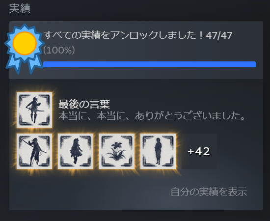

先月末に発売されたNieR Replicant ver.1.22474487139...[^1]を買いまして、一ヶ月弱ほどで実績を全て達成させられました。最初の方はほかのゲームと平行しつつのんびりとプレイしていたのですが周回を重ねてシナリオの核心に近付くにつれて続きが非常に気になってしまいここ数日はずっとNieR Replicantのことばかり考えていました。副業を始めたばかりであったり本業もちょうど忙しくなっていたタイミングではあったのですが睡眠時間や個人的な勉強の時間を犠牲にすることによって解決しました。

<!--truncate-->

ほぼ全ての武器を最高レベルまで強化させるという実績があり、強化するための素材アイテムを集めるのに時間をかけてしまった以外は大きく苦労する点はなくとても楽しませていただきました。また途中で難易度の変更が可能でEASYにすると戦闘時の操作をほとんど自動でやってくれるオートバトルを有効にできるのもし詰まっても大丈夫だろうというのは安心感に繋がりました。最終的に素材アイテムを集める際にHARDにしたりお金を集める際にEASYにした以外は難易度NORMALでプレイしていましたが安心感というものは大事ですね。

NieR Replicantはビジュアルが大変に好みで発売当時から気になっていたのですが当時は今以上に忙しく、またゲームが苦手ということもあり購入はせずにいました。それから数年を経てNieR:Automataはプレイしたのですが、PS3のゲームを今プレイするのはどうなのだろうと考えてしまい手を出せませんでした。なのでバージョンアップしてNieR Replicant ver.1.22474487139...が今回リリースされて大変ありがたい限りでした。

NieR:Automataもシナリオが非常にすばらしかったのですがNieR Replicantも同様にすばらしく本編はもちろんサブクエストでも感動のあまり瞳をうるませてしまいました。NieR:Automataで一部NieR Replicant劇中の話も出ていたため衝撃を受けられなかった場面やヨコオタロウ氏がディレクターを務めらているということで展開が読めてしまう場面もあったのですがそれでも楽しめる物語となっていて感情を大きく揺さ振られました。ただNieR:Automataよりも先にNieR Replicantをプレイしたかったという気持ちはどうしても生じてしまったので当時の自分の判断を悔んでしまいますね。

NieRシリーズと同様にヨコオタロウ氏がディレクターをされていてNieRシリーズとも物語が繋がっているというドラッグオンドラグーンも気になったのでぜひこちらもバージョンアップしてリリースしてもらいたいと思ってしまいました。NieR Replicant ver.1.22474487139...を買う人がひとりでも増えてくれたらうれしいと思い、この記事を書いています。

本当に、本当に、ありがとうございました。

[^1]: [NieR Replicant ver.1.22474487139... | SQUARE ENIX](https://www.jp.square-enix.com/nierreplicantv1p2/)
