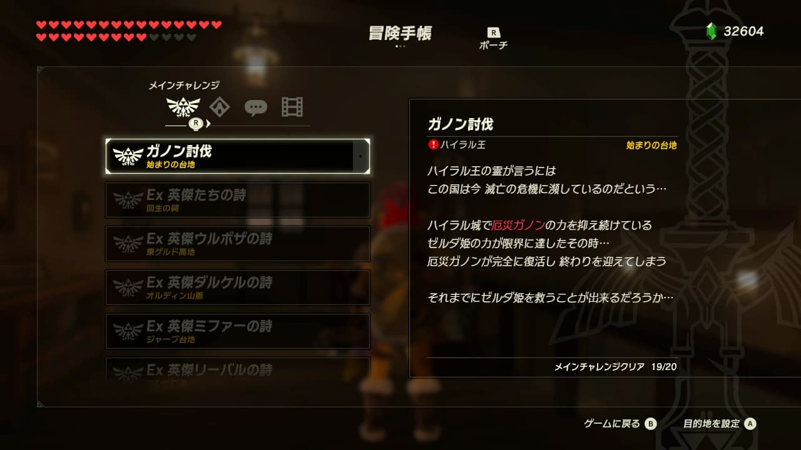
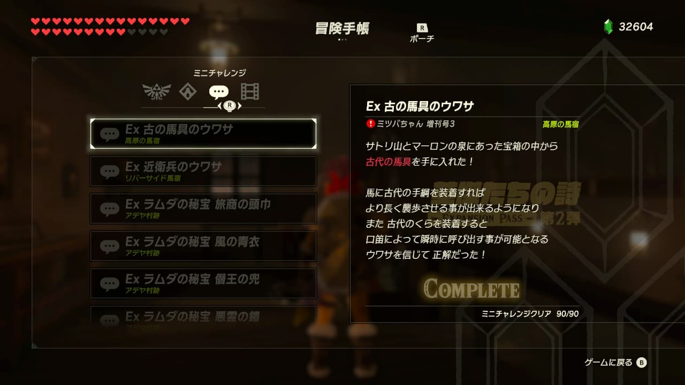
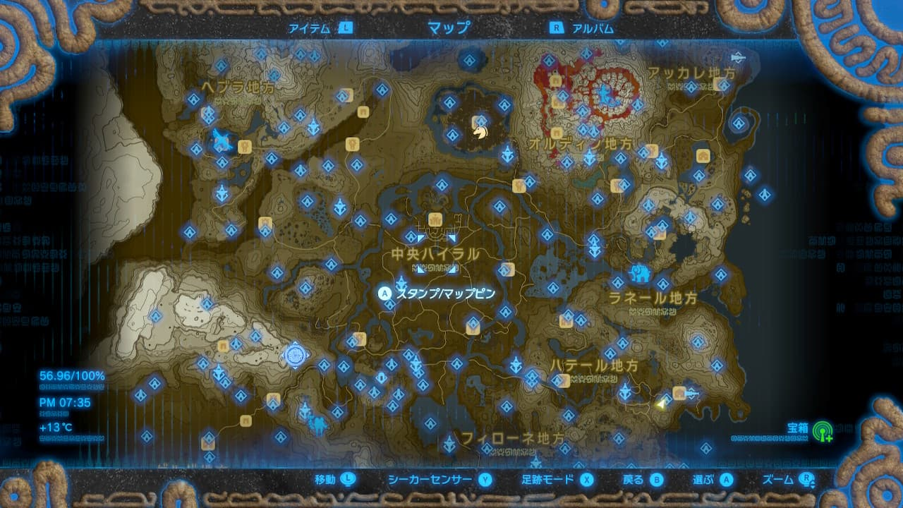
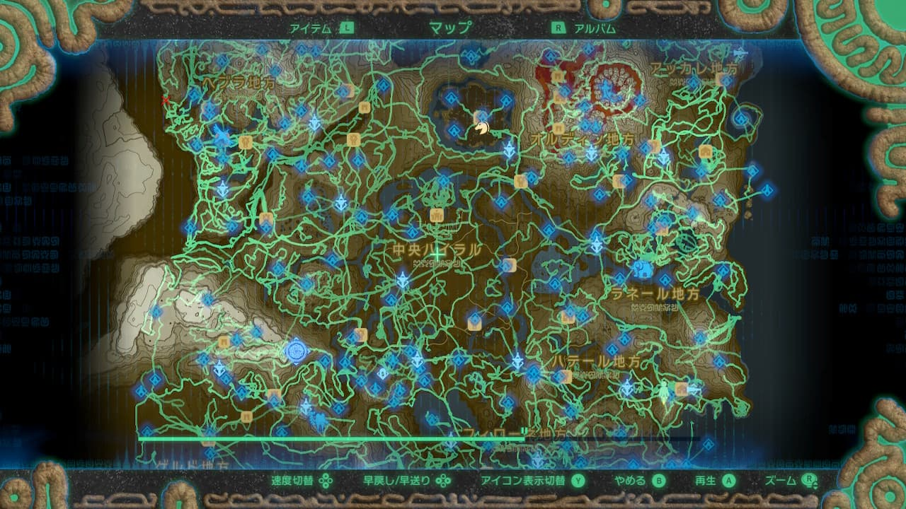

ゼルダの伝説 ブレス オブ ザ ワイルド[^1] (以下 ブレワイ) をクリアしました。記録によれば2019年7月に購入した2本でお得 ニンテンドーカタログチケット[^2] (以下 カタログチケット) を使って引き換えているようなのですがプレイを始めたのは2021年9月となり、二年以上もの間隔を空けてしまいましたね。

<!--truncate-->

四体の神獣を解放し、厄災ガノンを討伐してゲーム自体をクリアしたのはプレイ開始から十日ほどでした。クリアまでにかかった時間は100時間ほどでしたがこれはわたしがフィールドを歩き回るのが楽しくて寄り道ばかりしてしまったためですね。難しすぎず、かといって易しすぎたりもせず、とても良いバランス感のゲームで大変楽しませていただきました。

  

  

  

  

クリア後もミニチャレンジをひとつずつコンプリートしたり、マップの足跡を埋めつつフィールドの各所にいるコログを探したりしていました。途方もなく広いマップを歩いたり走ったり、または馬やバイクに乗ったりと移動するだけでも楽しくやめ時を見失ってしまうほどでした。ひとまずDLCを含めてメインチャレンジとミニチャレンジを全て達成したのとちょうど9月も終わるので一区切りをつけて残りは気が向いたときに少しずつ遊んでいこうかなと思っています。

  

  

  

  

ここまでブレワイにハマるとは全く思っておらず、当時は別のソフトと引き換えることを目的として購入したカタログチケットで併せて引き換えたソフトであったとはいえ二年も間隔を空けてしまったのは非常に悔しく思います。今回のブレワイがわたしにとって初めてのゼルダの伝説だったのですが、ゼルダの伝説シリーズにも強い興味を惹かれました。なので来月からは先日HD版が発売になったスカイウォードソード[^3]をプレイしようと考えています。Nintendo Switch Onlineに時のオカリナやムジュラの仮面も追加されるそうなのでそちらも楽しみですね。

[^1]: [ゼルダの伝説　ブレス オブ ザ ワイルド | Nintendo Switch / Wii U | Nintendo](https://www.nintendo.co.jp/zelda/)
[^2]: [2本でお得 ニンテンドーカタログチケット | My Nintendo Store (マイニンテンドーストア)](https://store-jp.nintendo.com/list/software/70020000000021.html)
[^3]: [ゼルダの伝説 スカイウォードソード HD | Nintendo Switch | 任天堂](https://www.nintendo.co.jp/switch/az89a/)
