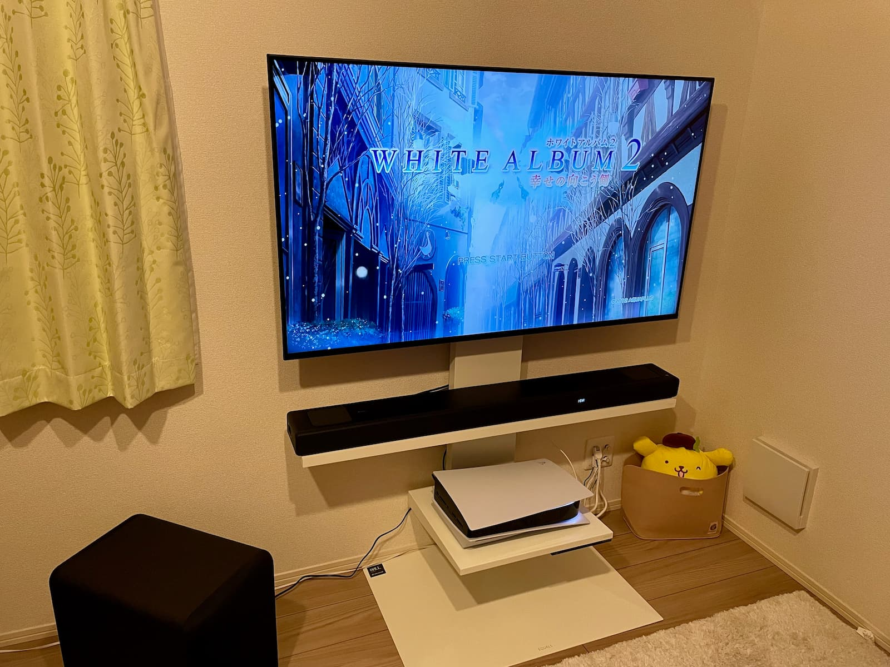

ゲームは基本的にWindows PCでプレイしているのに加えて購入しづらいという話を度々耳にしていたのでPlayStation 5 (PS5) は購入するつもりがあまりなかったのですが2023年夏に発売予定のFINAL FANTASY XVI (FF16) がPS5以外はサポートしないそうなのでPS5を購入しました。

<!--truncate-->

前述の通りFF16が発売される予定の来年の夏までに手に入れられていれば良かったので時間がかかっても良いので招待販売という形を取っていて招待のリクエストを一度すれば抽選が開始される度に登録等の作業をしなくても済むAmazonを使わせていただきました。

ただ今年9月にリクエストをして翌10月に購入権が得られるとは思っておらず購入しづらいという噂との乖離におどろきました。ちょうど新しいモデルであるCFI-1200の提供が開始されたばかりでかつAmazonでも旧モデルであるCFI-1100も並行して招待のリクエストを受け付けていたタイミングだったので招待のリクエストをしていた人が分散されていたおかげなのではないかと思います。おそらく運が良かったのでしょうね。

PS5自体は10月に手に入れられていたのですが1週間も経たない内にレストモード中に行われたと思われる始めてのアップデートの後から起動しなくなってしまい修理に出していました。わたしのメールボックスを「PlayStation 5」で検索するとAmazonの発送通知メールの直上に修理受け付けのメールが並んでいてなかなかに趣きがあります。

わたしはこれまでの人生でもう何度も電子機器の購入をしているのですがこうした初期不良に遭遇したのが始めてなので少しテンションが上がりましたが修理の依頼をしたり送付をするのは少し手間でした。幸いにもあまり待つことなく数日で新品に交換されて返ってきたので何よりでした。

修理から返ってくるのを待っている間に少し物欲が湧いてしまったので加えて液晶TVとサウンドバーも購入しました。もともと購入を検討していたのに加えてせっかくPS5がUltra HD Blu-rayに対応しているのだから……と理由づけていますがただの言いわけでしかありませんね。

おおよそ10年振りにTVを買ったのですが大型のものでもかなり安くなっていてありがたい限りですね。またスピーカーもバーチャルサラウンドのサウンドバーが主流になりつつあるようで省スペースに配置できるようなっているのも良かったです。サブウーファーも無線で繋げられるようになっていて配線に苦労せずに済むのも助かりました。

とはいえPS5を購入したもののRTX 3080を載せたWindows PCを使っているということもあってPS5でゲームを遊ぶ機会はだいぶ稀になってしまうと考えています。今はPlaySation Plusのプレミアムプランに加入していると利用できるクラシックスカタログでPS3版のWHITE ALBUM2を遊んでいます。

PS3版のWHITE ALBUM2は発売された2012年に購入してトロフィーも翌2013年にコンプリートしているどころか2010年と2011年に発売されたオリジナル版も2018年に発売されたEXTENDED EDITIONも繰り返しプレイしているのですが好きな作品なので何度遊んでも楽しいですね。冬の間にクリアできるようにゆっくりと楽しむ予定です。
